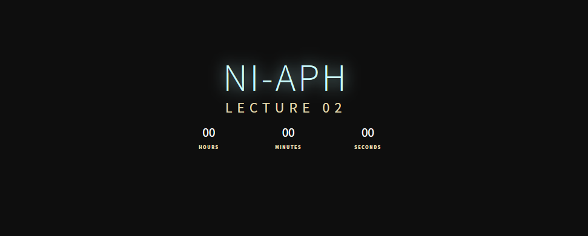
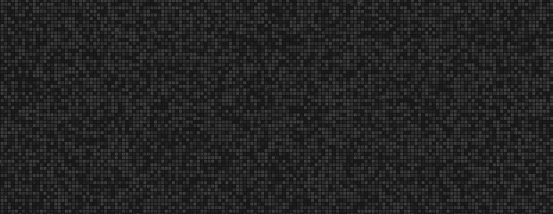
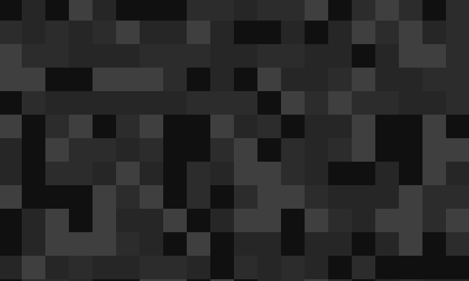
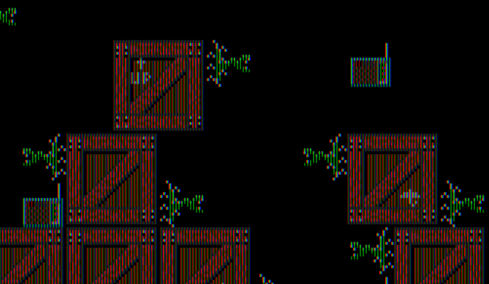
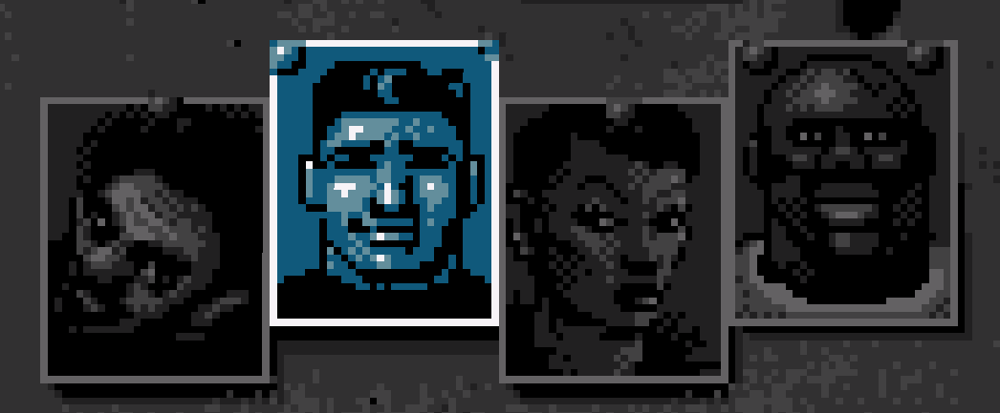
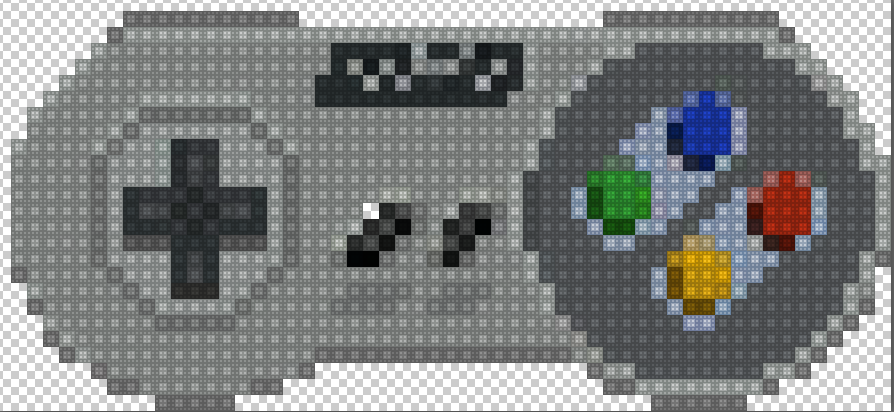

# APH Support

- a package of various scripts that are used for various purposes within APHGames

### Countdown
- Countdown script used for NI-APH Lecture 1 stream
- **Installation**
  - just open `index.html`

### Patterns
- Padolsey Pattern Generator, used for slides as a background
- **Installation**
  - just open `index.html`

### Vivus
- SVG animation used in Lectures in 2019
- Installation
  - `npm install`
  - `npm start`

### Scripts/bmfont-alphafix
- a script that fixes glyphs produced by Bitmap font generator (BMFont) - transforms black color into alpha channel
- Usage
  - put bitmap font into the project folder
  - run `node index.js`
  
### Scripts/brand-changer
- a script that goes through the SVG files and string-replaces given colors
- Usage
  - put your SVGS into the folder from which you execute the script
  - declare colors to replace within index.js
  - run `node index.js`

### Scripts/date-changer
- a script that changes EXIF Date Taken value of jpeg images
- Usage
  - put your JPG images into the folder from which you execute the script
  - run `node index.js`

### Scripts/domain-checker
- a brute-force script I used to find some great names for my ECSLite library
- spoiler alert: I didn't find any name
- the script goes through every word in words.txt and checks out if:
  - there is a taken github account
  - there is a NPM package of that name
  - there is a taken .io domain 
  - and if not, it will print it into output.txt
- Usage
  - put your words into words.txt (so far there are english words)
  - run `node index.js`

### Scripts/fade-to-noise
- creates a noise-like fade between two images. Used in Commodore64 fade-out in NI-APH Intro 2020
- Usage
  - add your images to the script folder, name them input.png and output.png respectively
  - run `node index.js`

### Scripts/gray-noise
- generates a gray noise. Used in NI-APH Trailer 2021 and a lots of background assets
- Usage
  - set the resolution inside index.js
  - run `node index.js`

### Scripts/image-resizer
- a simple image resizer
- Usage
  - edit `process` function inside `index.js` to set required boundaries
  - run `node index.js`

### Scripts/lcd-effect
- creates an LCD effect, usable for pixel-art images
- Usage
  - put your image into the script folder and name it `input.png`
  - run `node index.js`

### Scripts/pixelart-downscaler
- tries to downscale a pixel-art image (still WIP)
- Usage
  - put your images into the script folder (they must have .png extension) 
  - edit `index.js` and set the proper `MAX_SCALING` attribute (how many pixels for each real pixel) 
  - run `node index.js`

### Scripts/png-to-jpeg
- a simple png-to-jpeg converter
- Usage
  - put your images into the script folder (they must have .png extension) 
  - run `node index.js`

### Scripts/smooth-pixelart
- upscales an image to get a smooth pixel-art appearance (still WIP)
- Usage
  - put your images into the script folder (they must have .png extension) 
  - edit `index.js` and set `SCALE` and `ITERATIONS` according to your needs
  - run `node index.js`

### Scripts/tiscali-grabber
- a script that mines data from https://games.tiscali.cz/
- since APHGames.cz only contains the most interesting links, the output file must be, from time to time, recreated manually 😔
- Usage
  - run `node tiscali-grabber.js` to re-generate data_complete.txt
  - run `node txt-to-json.js` to re-generate JSON files